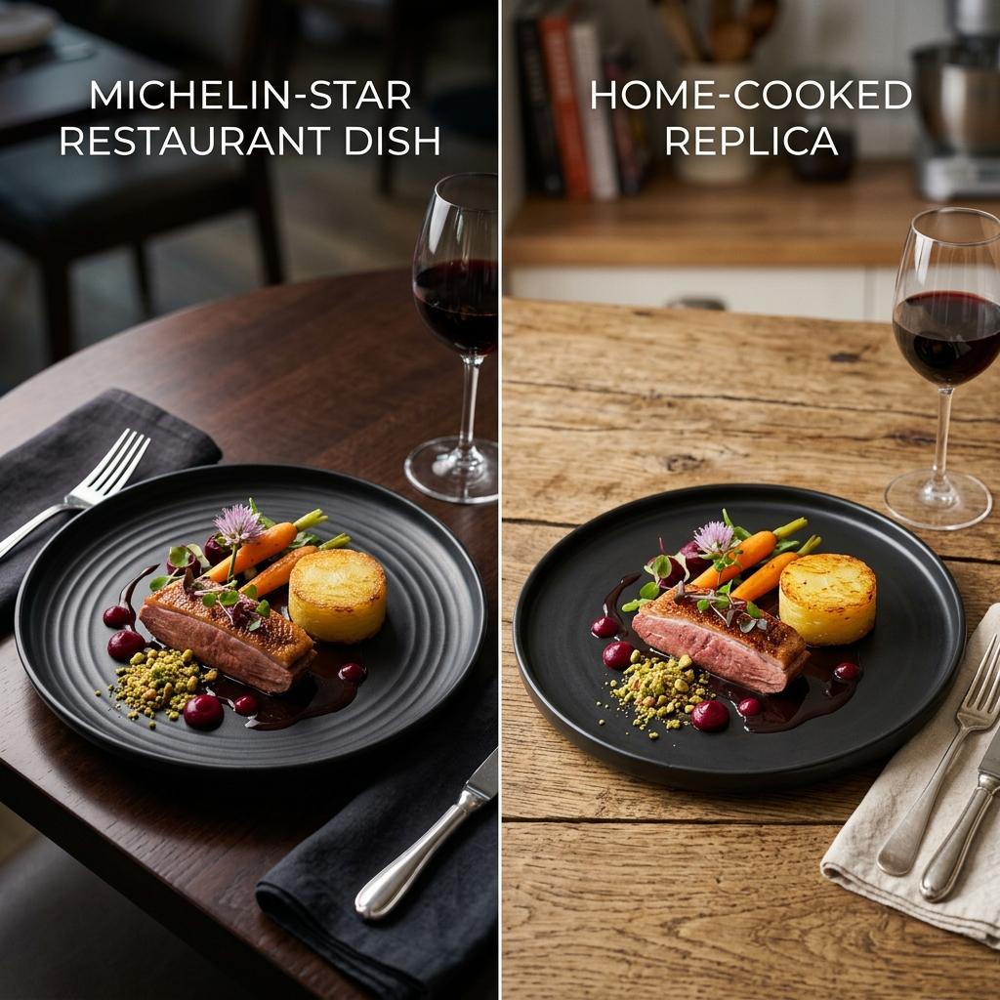
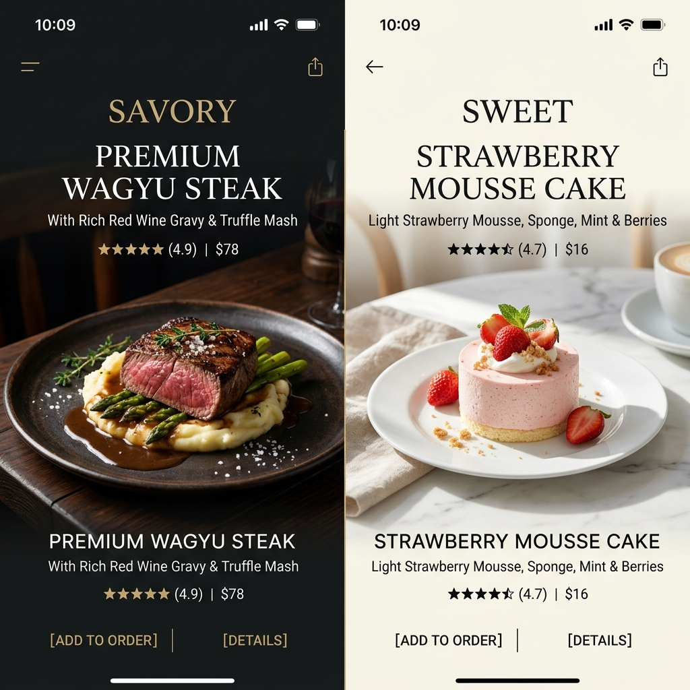
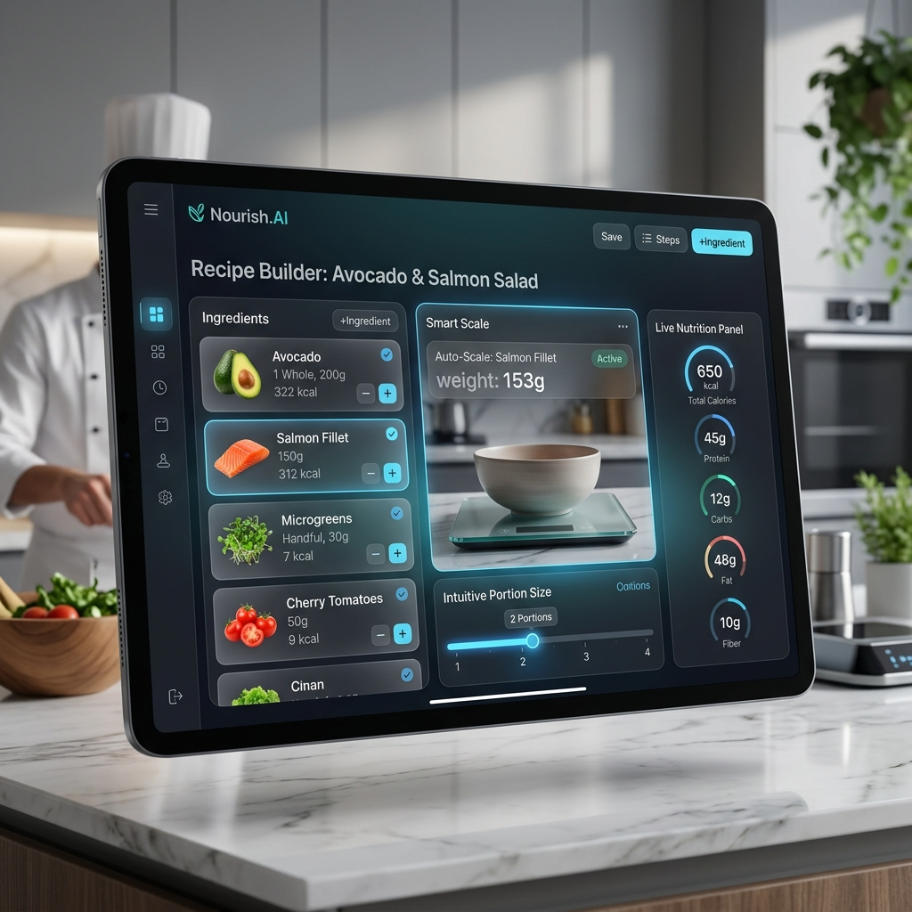
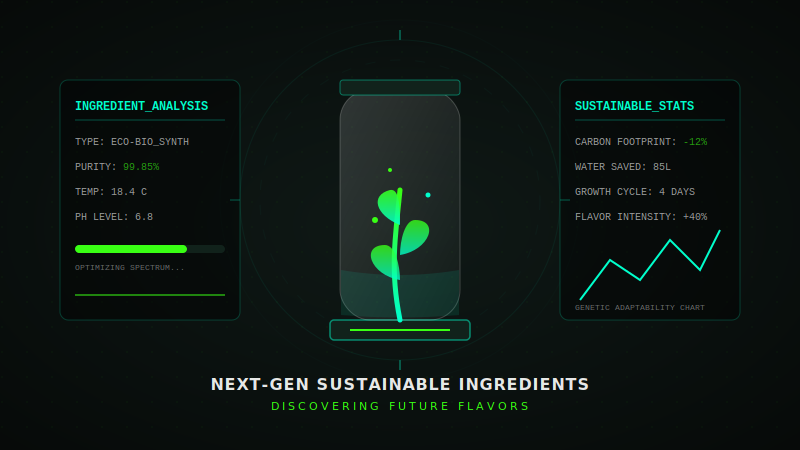
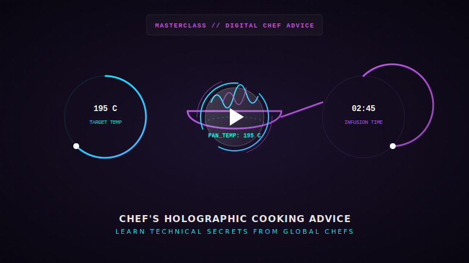

# แผนงานและรายละเอียดการพัฒนาเว็บไซต์แกะสูตรอาหารระดับโลก

เอกสารนี้ระบุรายละเอียด แนวทางการนำเสนอ และประเด็นที่น่าสนใจเพิ่มเติมสำหรับแต่ละหัวข้อหลัก เพื่อเตรียมความพร้อมก่อนเริ่มต้นพัฒนาเว็บไซต์ พร้อมภาพประกอบและตัวอย่างอินเตอร์เฟสวิดีโอ (VDO) ในโฟลเดอร์ `images`

---

## 1. การทำเว็บไซต์เกี่ยวกับการทำอาหารและแกะสูตรอาหารจากร้านดังต่างๆ ในโลก

### 💡 แนวทางการนำเสนอ (How to Present)
* **การเปรียบเทียบแบบเคียงข้าง (Side-by-Side Comparison):** นำเสนอรูปแบบภาพถ่ายและวิดีโอเปรียบเทียบ "ต้นฉบับ vs สูตรแกะกล่อง" ทั้งหน้าตา รสสัมผัส และวัตถุดิบหลัก เพื่อแสดงความโปร่งใสและน่าเชื่อถือ
* **มาตรวัดความเหมือน (Clonability Score):** มีตัวเลขเปอร์เซ็นต์ระบุว่าสูตรนี้แกะได้เหมือนร้านดังมากน้อยแค่ไหน (เช่น ความเหมือน 95% เนื่องจากหาซื้อวัตถุดิบได้ใกล้เคียงที่สุด)
* **การคำนวณต้นทุน vs ราคาขาย (Cost Breakdown):** แสดงตารางเปรียบเทียบราคาเมื่อทานที่ร้านและต้นทุนการทำเองที่บ้าน เพื่อจูงใจให้ผู้ชมเกิดความรู้สึกคุ้มค่าที่จะลองทำตาม

### 🌟 ประเด็นที่น่าสนใจเพิ่มเติม (Interesting Points)
* **วิทยาศาสตร์การอาหาร (Food Science):** อธิบายหลักการเบื้องหลังที่ทำให้อาหารร้านดังอร่อย เช่น การคุมอุณหภูมิซอสอย่างละเอียด หรือการบ่มเนื้อ (Aging) เพื่อให้คนทำตามเข้าใจเชิงลึกไม่ใช่แค่จำสูตร
* **ประวัติศาสตร์ของจานอาหาร (Storytelling):** สอดแทรกความเป็นมาของร้านดังและเมนูนั้นๆ เพื่อสร้างความผูกพันและคุณค่าให้แก่อาหารจานนั้น

---

## 2. แกะสูตรอาหารคาวและอาหารหวาน

### 💡 แนวทางการนำเสนอ (How to Present)
* **หน้าเว็บแบบทูโทน (Dual-Theme Interface):** แบ่งโซนอาหารคาวและหวานออกจากกันอย่างชัดเจนด้วยโทนสี เช่น ฝั่งคาวใช้โทนสีเข้มอบอุ่น (Warm/Moody) ฝั่งหวานใช้โทนสีสว่างพาสเทล (Light/Pastel)
* **เครื่องมือทำอาหารแบบโต้ตอบ (Interactive Cooking Mode):** เมื่อกดทำอาหาร จะแสดงคู่มือทีละขั้นตอนพร้อมหน้าจอป้องกันเครื่องปิด (Keep Screen On) และระบบตัวจับเวลาอัตโนมัติ (Built-in Timer) ในแต่ละขั้นตอน

### 🌟 ประเด็นที่น่าสนใจเพิ่มเติม (Interesting Points)
* **การจัดคอร์สอาหาร (Course Planning):** ฟังก์ชันจับคู่เซ็ตอาหารคาวและหวานเพื่อเสิร์ฟด้วยกัน (เช่น เมนูคาวสุดหรูคู่กับเมนูหวานที่ช่วยตัดเลี่ยน) เหมาะสำหรับงานจัดเลี้ยงหรือมื้อพิเศษ
* **คำแนะนำด้านการแพ้อาหาร (Dietary Filters):** คัดกรองสูตรคาว/หวานตามข้อจำกัดของผู้ใช้ เช่น มังสวิรัติ, คีโต, ปราศจากกลูเตน (Gluten-free) หรือจำกัดถั่วและนม

---

## 3. สร้างสูตรอาหารขึ้นมาใหม่

### 💡 แนวทางการนำเสนอ (How to Present)
* **สูตรอาหารฟิวชันที่เป็นเอกลักษณ์ (Signature Fusion Recipes):** สร้างแบรนด์ของเว็บไซต์เองด้วยการนำเสนอเมนูแปลกใหม่ เช่น การผสมผสานอาหารไทยและอาหารตะวันตก (เช่น ราเมนซอสแกงคั่วปูใบชะพลู)
* **การจำลองสัดส่วนอัตโนมัติ (Portion Scaler):** ผู้ใช้สามารถกดปรับเปลี่ยนจำนวนเสิร์ฟ (เช่น จาก 2 คน เป็น 6 คน) แล้วระบบจะคำนวณปริมาณวัตถุดิบและเครื่องปรุงตามสัดส่วนให้โดยอัตโนมัติ

### 🌟 ประเด็นที่น่าสนใจเพิ่มเติม (Interesting Points)
* **ระบบค้นหาจากของในตู้เย็น (What's in my Fridge?):** ให้ผู้ใช้เลือกใส่ข้อมูลวัตถุดิบที่ค้างอยู่ในตู้เย็น แล้วเว็บไซต์จะประมวลผลแนะนำสูตรที่สร้างสรรค์ขึ้นมาใหม่จากวัตถุดิบเหล่านั้น
* **ห้องทดลองสูตร (Recipe Lab & Playground):** พื้นที่แชร์ไอเดียทดลองปรับเปลี่ยนสูตรของคอมมูนิตี้ เพื่อกระตุ้นการมีส่วนร่วมของสมาชิก

---

## 4. พร้อมกับเสนอวัตถุดิบใหม่ๆ

### 💡 แนวทางการนำเสนอ (How to Present)
* **คอลัมน์เจาะลึกวัตถุดิบ (Ingredient Spotlight):** ทุกสัปดาห์จะมีการนำเสนอวัตถุดิบพิเศษที่ไม่คุ้นเคย เช่น พืชสมุนไพรท้องถิ่น หรือเทรนด์วัตถุดิบทางเลือกใหม่ พร้อมทั้งอธิบายรสสัมผัส วิธีใช้ และประโยชน์ต่อสุขภาพ
* **ตารางวัตถุดิบทดแทน (Substitution Index):** หากไม่สามารถหาซื้อวัตถุดิบแปลกใหม่หรือวัตถุดิบของร้านดังได้ จะมีรายการแนะนำวัตถุดิบทางเลือกที่ใช้แทนกันได้เพื่อผลลัพธ์ใกล้เคียงที่สุด

### 🌟 ประเด็นที่น่าสนใจเพิ่มเติม (Interesting Points)
* **การเชื่อมโยงการซื้อขาย (Affiliate & Marketplace Integration):** ใส่พิกัดชี้เป้าหรือลิงก์สั่งซื้อวัตถุดิบพิเศษเหล่านั้นทางออนไลน์ เพื่อให้ผู้ใช้งานสะดวกสบายที่สุด
* **วัตถุดิบที่ยั่งยืน (Eco-friendly & Local Sourcing):** ส่งเสริมแนวคิดการใชวัตถุดิบธรรมชาติจากท้องถิ่นเพื่อช่วยลดคาร์บอนฟุตพริ้นท์และสนับสนุนเกษตรกรไทย

---

## 5. มีเชฟดังๆ เข้ามาให้คำแนะนำ

### 💡 แนวทางการนำเสนอ (How to Present)
* **เทคนิคพิเศษจากเชฟ (Chefs Pro-Tips):** ใส่กล่องคำแนะนำย่อยๆ หรือวิดีโอสั้นจากเชฟแทรกอยู่ในตัวสูตร เช่น "เคล็ดลับของเชฟในการทอดปลาไม่ให้ติดกระทะ" หรือ "วิธีการจัดจานให้เหมือนร้านมิชลินสตาร์"
* **การรับรองสูตรโดยเชฟ (Chef's Endorsement Badge):** มีป้ายสัญลักษณ์กำกับสูตรอาหารที่ผ่านการรีวิวและทดสอบรสชาติจากเชฟชื่อดังแล้ว เพื่อความน่าเชื่อถือระดับสูงสุด

### 🌟 ประเด็นที่น่าสนใจเพิ่มเติม (Interesting Points)
* **กิจกรรมถาม-ตอบกับเชฟ (Chef Ask Me Anything / AMA):** จัดเซสชันสดทุกๆ สัปดาห์หรือทุกๆ เดือน ให้ผู้ใช้ส่งคำถามเกี่ยวกับการแก้ปัญหาการทำอาหารมาให้เชฟตอบโดยตรง
* **หลักสูตรออนไลน์สั้นๆ (Mini Masterclass):** วิดีโอสอนเทคนิคพื้นฐานเฉพาะตัวของเชฟ เช่น การหั่นผักสไตล์ฝรั่งเศส หรือการปรุงซอสเบสิคต่างๆ

---

## 6. เข้าถึงผู้คนและเข้าถึงเชฟดังๆ ทั่วโลก

### 💡 แนวทางการนำเสนอ (How to Present)
* **ระบบแปลภาษาอัจฉริยะ (Multi-Language Interface):** ออกแบบระบบที่สามารถแสดงผลได้ทั้งภาษาไทย ภาษาอังกฤษ และภาษาอื่นๆ เพื่อให้แพลตฟอร์มขยายตัวสู่สากลได้ง่าย
* **แผนที่อาหารโลก (Interactive Taste Map):** การจัดประเภทอาหารตามพื้นที่ต้นกำเนิดบนแผนที่โลก ผู้ชมสามารถคลิกเลือกแผนที่ภูมิภาคต่างๆ เพื่อค้นหาสูตรอาหารจากท้องถิ่นนั้นๆ ได้

### 🌟 ประเด็นที่น่าสนใจเพิ่มเติม (Interesting Points)
* **ระบบเชฟคอมมูนิตี้ (Chef Network & Collaboration Portal):** ช่องทางสำหรับเชฟทั่วโลกในการสมัครสมาชิก ยื่นขอการรับรองโปรไฟล์ (Verified Chef) และนำเสนอโปรโมตเมนูพิเศษหรือร้านอาหารของตนเอง
* **กิจกรรมการแข่งขันทำอาหารระดับโลก (Community Cooking Challenge):** จัดกิจกรรมท้าทายประจำเดือน ให้ผู้ใช้ทำเมนูตามสูตรที่แกะและอัปโหลดรูปภาพเพื่อชิงรางวัล หรือได้รับคำชมจากเชฟชื่อดัง

---

## 7. ข้อมูลเมนูอาหารและระบบฟังก์ชันการทำงานหลัก (Menu Database & Core System Functions)

### 📊 1. ฐานข้อมูลเมนูอาหารคาวและหวาน (Menu Database)
เราจะกำหนดรายละเอียดเมนูคาว 20 เมนู และเมนูหวาน 20 เมนู (รวมทั้งสิ้น 40 เมนู) ที่มีคุณสมบัติพร้อมสำหรับการค้นหา คัดกรอง และคำนวณสัดส่วน

#### 🍖 เมนูอาหารคาว (Savory Menus - 20 เมนู)
1. **กะเพราเนื้อสับไข่ดาว (ร้านกะเพราเนื้อชื่อดัง)**
   - หมวดหมู่: อาหารไทย, อาหารคาว, ทำง่าย, ใช้เวลาน้อยกว่า 30 นาที
   - พลังงาน: 550 kcal
   - เวลาทำ: 15 นาที
2. **ผัดไทยกุ้งสด (ร้านผัดไทยทิพย์สมัย)**
   - หมวดหมู่: อาหารไทย, อาหารคาว
   - พลังงาน: 620 kcal
   - เวลาทำ: 25 นาที
3. **ข้าวขาหมู (ร้านขาหมูตรอกซุง)**
   - หมวดหมู่: อาหารไทย, อาหารคาว
   - พลังงาน: 750 kcal
   - เวลาทำ: 120 นาที
4. **แกงเขียวหวานไก่ (ครัวสุธัญญพัทธ์)**
   - หมวดหมู่: อาหารไทย, อาหารคาว
   - พลังงาน: 480 kcal
   - เวลาทำ: 35 นาที
5. **ต้มยำกุ้งน้ำข้น (เจ๊โอว)**
   - หมวดหมู่: อาหารไทย, อาหารคาว, ใช้เวลาน้อยกว่า 30 นาที
   - พลังงาน: 350 kcal
   - เวลาทำ: 20 นาที
6. **สปาเกตตีคาโบนาร่า (Jamie's Italian)**
   - หมวดหมู่: อาหารต่างประเทศ, อาหารคาว, ทำง่าย, ใช้เวลาน้อยกว่า 30 นาที
   - พลังงาน: 680 kcal
   - เวลาทำ: 20 นาที
7. **สเต็กเนื้อริบอายซอสเกรวี่ (Gordon Ramsay Steak)**
   - หมวดหมู่: อาหารต่างประเทศ, อาหารคาว, ใช้เวลาน้อยกว่า 30 นาที
   - พลังงาน: 700 kcal
   - เวลาทำ: 25 นาที
8. **ลาซันญ่าเนื้อ (ร้านอิตาเลียนดัง)**
   - หมวดหมู่: อาหารต่างประเทศ, อาหารคาว
   - พลังงาน: 650 kcal
   - เวลาทำ: 60 นาที
9. **ทงคัตสึหมูทอด (ร้าน Maisen)**
   - หมวดหมู่: อาหารต่างประเทศ, อาหารคาว
   - พลังงาน: 610 kcal
   - เวลาทำ: 40 นาที
10. **ราเมนน้ำซุปทงคตสึ (ร้าน Ichiran)**
    - หมวดหมู่: อาหารต่างประเทศ, อาหารคาว
    - พลังงาน: 780 kcal
    - เวลาทำ: 90 นาที
11. **ข้าวหน้าเนื้อกิวด้ง (ร้าน Yoshinoya)**
    - หมวดหมู่: อาหารต่างประเทศ, อาหารคาว, ทำง่าย, ใช้เวลาน้อยกว่า 30 นาที
    - พลังงาน: 580 kcal
    - เวลาทำ: 20 นาที
12. **แกงกะหรี่หมูทอด (ร้าน CoCo Ichibanya)**
    - หมวดหมู่: อาหารต่างประเทศ, อาหารคาว
    - พลังงาน: 850 kcal
    - เวลาทำ: 45 นาที
13. **ต้มข่าไก่สูตรดั้งเดิม**
    - หมวดหมู่: อาหารไทย, อาหารคาว, เมนูสุขภาพ, ทำง่าย, ใช้เวลาน้อยกว่า 30 นาที
    - พลังงาน: 320 kcal
    - เวลาทำ: 25 นาที
14. **สลัดโรลอกไก่กับน้ำสลัดงาญี่ปุ่น**
    - หมวดหมู่: อาหารต่างประเทศ, อาหารคาว, เมนูสุขภาพ, มังสวิรัติ (เมื่อไม่ใส่อกไก่), คลีน/แคลอรี่ต่ำ, ทำง่าย, ใช้เวลาน้อยกว่า 30 นาที
    - พลังงาน: 180 kcal
    - เวลาทำ: 15 นาที
15. **เต้าหู้มาโป (Mapo Tofu - ร้านดังเสฉวน)**
    - หมวดหมู่: อาหารต่างประเทศ, อาหารคาว, มังสวิรัติ, แคลอรี่ต่ำ, ทำง่าย, ใช้เวลาน้อยกว่า 30 นาที
    - พลังงาน: 220 kcal
    - เวลาทำ: 20 นาที
16. **ส้มตำไทยไข่เค็ม (ส้มตำเจ๊กี)**
    - หมวดหมู่: อาหารไทย, อาหารคาว, เมนูสุขภาพ, มังสวิรัติ, แคลอรี่ต่ำ, ทำง่าย, ใช้เวลาน้อยกว่า 30 นาที
    - พลังงาน: 150 kcal
    - เวลาทำ: 10 นาที
17. **ผัดซีอิ๊วหมูนุ่ม (ผัดซีอิ๊วร้านดังเยาวราช)**
    - หมวดหมู่: อาหารไทย, อาหารคาว, ทำง่าย, ใช้เวลาน้อยกว่า 30 นาที
    - พลังงาน: 520 kcal
    - เวลาทำ: 15 นาที
18. **ต้มจืดเต้าหู้หมูสับ**
    - หมวดหมู่: อาหารไทย, อาหารคาว, เมนูสุขภาพ, แคลอรี่ต่ำ, ทำง่าย, ใช้เวลาน้อยกว่า 30 นาที
    - พลังงาน: 120 kcal
    - เวลาทำ: 15 นาที
19. **ไก่ผัดเม็ดมะม่วงหิมพานต์**
    - หมวดหมู่: อาหารไทย, อาหารคาว
    - พลังงาน: 450 kcal
    - เวลาทำ: 35 นาที
20. **สเต็กปลาแซลมอนย่างเกลือ**
    - หมวดหมู่: อาหารต่างประเทศ, อาหารคาว, เมนูสุขภาพ, แคลอรี่ต่ำ, ทำง่าย, ใช้เวลาน้อยกว่า 30 นาที
    - พลังงาน: 350 kcal
    - เวลาทำ: 20 นาที

#### 🍰 เมนูของหวานและเครื่องดื่ม (Sweet & Beverage Menus - 20 เมนู)
1. **บัวลอยมะพร้าวอ่อนอัญชัน (บัวลอยคลองสาน)**
   - หมวดหมู่: อาหารไทย, ของหวาน, ทำง่าย
   - พลังงาน: 320 kcal
   - เวลาทำ: 35 นาที
2. **ข้าวเหนียวมะม่วง (ร้าน ก.พานิช)**
   - หมวดหมู่: อาหารไทย, ของหวาน, วีแกน, มังสวิรัติ
   - พลังงาน: 450 kcal
   - เวลาทำ: 40 นาที
3. **ทองหยอด / ฝอยทอง (ร้านขนมไทยโบราณ)**
   - หมวดหมู่: อาหารไทย, ของหวาน, มังสวิรัติ
   - พลังงาน: 350 kcal
   - เวลาทำ: 50 นาที
4. **ทับทิมกรอบ (ร้านทับทิมกรอบวงเวียนใหญ่)**
   - หมวดหมู่: อาหารไทย, ของหวาน, มังสวิรัติ, ทำง่าย, ใช้เวลาน้อยกว่า 30 นาที
   - พลังงาน: 250 kcal
   - เวลาทำ: 25 นาที
5. **กล้วยบวชชีสูตรกะทิอบควันเทียน**
   - หมวดหมู่: อาหารไทย, ของหวาน, วีแกน, มังสวิรัติ, ทำง่าย, ใช้เวลาน้อยกว่า 30 นาที
   - พลังงาน: 280 kcal
   - เวลาทำ: 20 นาที
6. **ช็อกโกแลตลาวา (ร้าน After You)**
   - หมวดหมู่: อาหารต่างประเทศ, ของหวาน, มังสวิรัติ, ใช้เวลาน้อยกว่า 30 นาที
   - พลังงาน: 420 kcal
   - เวลาทำ: 20 นาที
7. **ฮันนี่โทสต์ (ร้าน After You)**
   - หมวดหมู่: อาหารต่างประเทศ, ของหวาน, มังสวิรัติ
   - พลังงาน: 680 kcal
   - เวลาทำ: 35 นาที
8. **ชูครีมวานิลลา (ร้าน Beard Papa's)**
   - หมวดหมู่: อาหารต่างประเทศ, ของหวาน, มังสวิรัติ
   - พลังงาน: 220 kcal
   - เวลาทำ: 60 นาที
9. **ทีรามิสุ (ร้านอิตาเลียนดัง)**
   - หมวดหมู่: อาหารต่างประเทศ, ของหวาน, มังสวิรัติ, ทำง่าย
   - พลังงาน: 380 kcal
   - เวลาทำ: 45 นาที
10. **ชีสเค้กหน้าไหม้ (Basque Burnt Cheesecake)**
    - หมวดหมู่: อาหารต่างประเทศ, ของหวาน, มังสวิรัติ
    - พลังงาน: 400 kcal
    - เวลาทำ: 50 นาที
11. **มาการองวานิลลา (Pierre Hermé)**
    - หมวดหมู่: อาหารต่างประเทศ, ของหวาน, มังสวิรัติ
    - พลังงาน: 150 kcal
    - เวลาทำ: 90 นาที
12. **แพนเค้กซูเฟล่ญี่ปุ่น (ร้าน Gram)**
    - หมวดหมู่: อาหารต่างประเทศ, ของหวาน, มังสวิรัติ, ใช้เวลาน้อยกว่า 30 นาที
    - พลังงาน: 320 kcal
    - เวลาทำ: 25 นาที
13. **บราวนี่หน้าฟิล์มสูตรเนื้อหนึบ**
    - หมวดหมู่: อาหารต่างประเทศ, ของหวาน, มังสวิรัติ, ทำง่าย
    - พลังงาน: 290 kcal
    - เวลาทำ: 35 นาที
14. **วุ้นมะพร้าวน้ำหอมใบเตย**
    - หมวดหมู่: อาหารไทย, ของหวาน, วีแกน, มังสวิรัติ, แคลอรี่ต่ำ, ทำง่าย, ใช้เวลาน้อยกว่า 30 นาที
    - พลังงาน: 90 kcal
    - เวลาทำ: 20 นาที
15. **พานาคอตต้าซอสสตรอเบอร์รี่**
    - หมวดหมู่: อาหารต่างประเทศ, ของหวาน, มังสวิรัติ, แคลอรี่ต่ำ, ใช้เวลาน้อยกว่า 30 นาที
    - พลังงาน: 180 kcal
    - เวลาทำ: 20 นาที
16. **ชาไทยเย็นใส่นม (ร้านชาตรามือ)**
    - หมวดหมู่: เครื่องดื่ม, มังสวิรัติ, ทำง่าย, ใช้เวลาน้อยกว่า 30 นาที
    - พลังงาน: 200 kcal
    - เวลาทำ: 5 นาที
17. **มัทฉะลาเต้เย็นสูตรพรีเมียม**
    - หมวดหมู่: เครื่องดื่ม, มังสวิรัติ, เมนูสุขภาพ, ทำง่าย, ใช้เวลาน้อยกว่า 30 นาที
    - พลังงาน: 120 kcal
    - เวลาทำ: 5 นาที
18. **อเมริกาโน่น้ำส้มคั้นสด**
    - หมวดหมู่: เครื่องดื่ม, วีแกน, มังสวิรัติ, เมนูสุขภาพ, แคลอรี่ต่ำ, ทำง่าย, ใช้เวลาน้อยกว่า 30 นาที
    - พลังงาน: 60 kcal
    - เวลาทำ: 5 นาที
19. **อัฟโฟกาโต (Affogato - กาแฟราดไอศกรีม)**
    - หมวดหมู่: เครื่องดื่ม, ของหวาน, มังสวิรัติ, ทำง่าย, ใช้เวลาน้อยกว่า 30 นาที
    - พลังงาน: 180 kcal
    - เวลาทำ: 5 นาที
20. **มิกซ์เบอร์รี่สมูทตี้โยเกิร์ต**
    - หมวดหมู่: เครื่องดื่ม, เมนูสุขภาพ, มังสวิรัติ, แคลอรี่ต่ำ, ทำง่าย, ใช้เวลาน้อยกว่า 30 นาที
    - พลังงาน: 140 kcal
    - เวลาทำ: 10 นาที

---

### 📱 2. หน้าแสดงรายละเอียดเมนู (Recipe Detail Page)
เมื่อผู้ใช้งานเลือกเมนูใดๆ จากรายการ หน้าเว็บจะเปิดหน้ารายละเอียดสูตรอาหาร (Recipe Detail) ที่นำเสนอดังนี้:
* **ส่วนหัวข้อสูตร (Header Section):**
  - แสดงภาพเมนูขนาดใหญ่ พร้อมชื่อเมนู และระดับ "ความเหมือนสูตรต้นฉบับ (Clonability Score)"
  - แสดงข้อมูลสรุป เช่น เวลาที่ใช้ทำทั้งหมด ระดับความยาก แคลอรี่ต่อเสิร์ฟ และคะแนนรีวิวจากผู้ใช้
* **ส่วนคำนวณจำนวนเสิร์ฟ (Dynamic Portion Calculator):**
  - มีช่องกรอก/ปุ่มปรับลดจำนวนเสิร์ฟ (เริ่มต้นที่ 2 เสิร์ฟ) ผู้ใช้สามารถพิมพ์ตัวเลขหรือกดปุ่มบวกลบได้
* **ตารางวัตถุดิบและสัดส่วน (Interactive Ingredients List):**
  - แสดงรายการวัตถุดิบแยกตามส่วนผสมหลักและส่วนผสมซอส
  - ปริมาณของวัตถุดิบจะอัปเดตแบบเรียลไทม์ตามจำนวนเสิร์ฟที่กรอก
  - มี Checkbox ข้างวัตถุดิบแต่ละชิ้น เพื่อให้ผู้ใช้ติ๊กเลือกเมื่อเตรียมของเสร็จแล้ว
* **ขั้นตอนการทำแบบละเอียด (Step-by-Step Instructions):**
  - อธิบายขั้นตอนอย่างเป็นระเบียบ พร้อมรูปภาพ/วิดีโอแนะนำในแต่ละขั้นตอน
  - ระบบนาฬิกาจับเวลา (Timer) ในขั้นตอนที่ต้องจับเวลา (เช่น "เคี่ยวน้ำซุป 15 นาที") โดยสามารถกดจับเวลาได้จากหน้าเว็บทันที
* **เคล็ดลับจากเชฟดัง (Chef's Pro-Tips):**
  - กล่องแสดงคำแนะนำหรือเทคนิคเสริมจากเชฟเพื่อการปรุงที่สมบูรณ์แบบ

---

### 🔍 3. ระบบค้นหา (Search System)
* **กล่องค้นหาแบบ Real-Time (Instant Search):**
  - ค้นหาได้จาก **ชื่อเมนู** (ทั้งภาษาไทยและอังกฤษ) หรือ **ชื่อร้านดังต้นฉบับ** (เช่น "After You", "เจ๊โอว", "Ichiran")
  - ค้นหาจาก **ชื่อวัตถุดิบหลัก** (เช่น กรอก "เนื้อสับ" หรือ "กุ้ง" แล้วจะแสดงเมนูที่มีส่วนผสมนั้นๆ)
* **คำค้นหายอดฮิต (Trending Searches):**
  - แสดงปุ่มคำค้นหาด่วนยอดนิยมใต้กล่องค้นหา เพื่อช่วยแนะนำไอเดียการทำอาหาร
* **ระบบแนะคำอัตโนมัติ (Search Auto-Suggestions):**
  - แนะนำเมนูที่ใกล้เคียงเมื่อเริ่มพิมพ์ เพื่อความสะดวกรวดเร็วในการเข้าถึง

---

### 🎛️ 4. ระบบกรองสูตรอาหาร (Filters)
มีแถบ Sidebar หรือปุ่ม Filter ด้านบนหน้าเว็บ ให้ผู้ใช้คัดกรองเมนูตามความสนใจ โดยรองรับเงื่อนไขต่อไปนี้:
* **ประเภทอาหารหลัก:**
  - อาหารไทย (Thai Food)
  - อาหารต่างประเทศ (International Food)
  - อาหารคาว (Savory)
  - ของหวาน (Sweet)
  - เครื่องดื่ม (Beverage)
* **ข้อจำกัดและการดูแลสุขภาพ:**
  - เมนูสุขภาพ (Healthy Menu)
  - มังสวิรัติ (Vegetarian)
  - วีแกน (Vegan)
  - แคลอรี่ต่ำ (Low Calorie - พลังงานต่ำกว่า 300 kcal ต่อเสิร์ฟ)
* **ความสะดวกและเวลา:**
  - ทำง่าย (Easy to Make)
  - ใช้เวลาน้อยกว่า 30 นาที (Under 30 Minutes)

---

### 🧮 5. ระบบคำนวณจำนวนเสิร์ฟ (Dynamic Portion Calculator)
* **ฟังก์ชันการทำงาน:**
  - ระบบจะคำนวณสูตรอาหารโดยยึดสัดส่วนพื้นฐานต่อเสิร์ฟดั้งเดิมไว้ในรหัสโปรแกรม
  - เมื่อผู้ใช้ระบุจำนวนเสิร์ฟ (Portions) ที่ต้องการทำด้วยตนเอง ระบบจะนำปริมาณดั้งเดิมคำนวณใหม่ตามสัดส่วนโดยอัตโนมัติ
  - รองรับการป้อนตัวเลขโดยตรงในช่องกรอกข้อมูล หรือคลิกปุ่มเพิ่ม/ลดเพื่อปรับปริมาณ
  - แสดงปริมาณวัตถุดิบที่ปรับตามสเกลที่ระบุอย่างสมจริง เพื่อความสะดวกในการเตรียมครัว